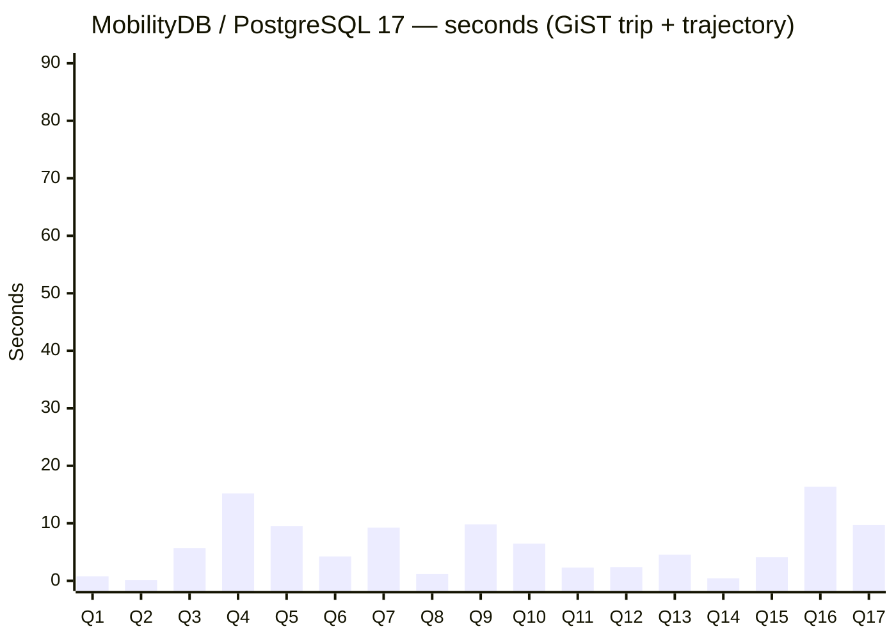
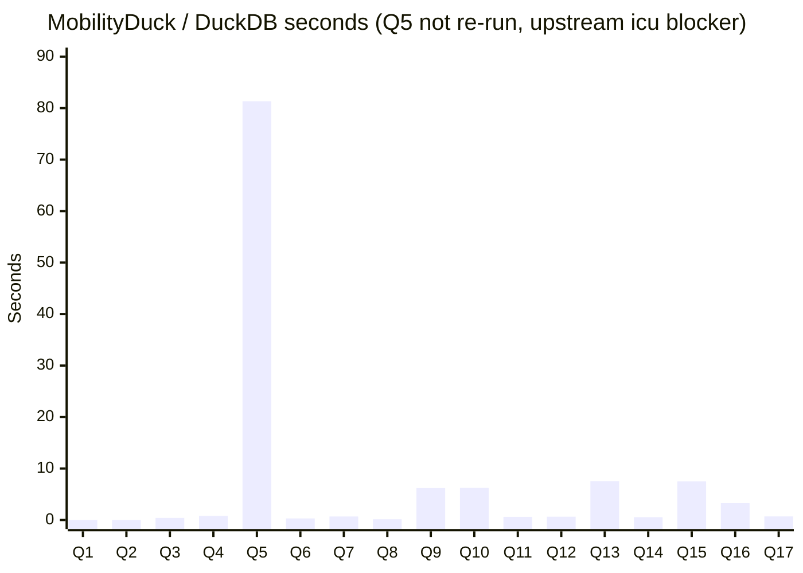

# Three-platform timing comparison — BerlinMOD 17 R-queries

**Date**: 2026-05-15
**Dataset**: BerlinMOD scalefactor 0.005, 1620 trips, 141 vehicles
**Hardware**: single-node WSL2 dev machine
**Runs**: 1 per query per platform; Q5 median of three runs
**Schema**: same generated CSV files on every platform; deterministic
`ORDER BY <PrimaryKey>` LIMIT-10 parameter views

Row counts are identical across the platforms that produce them
(the bench validates this before reporting timings):

```
Q1:72  Q2:1  Q3:6  Q4:80  Q6:0  Q7:26  Q8:75  Q9:94
Q10:21 Q11:0 Q12:0 Q13:278 Q14:1  Q15:118 Q16:2 Q17:1
```

Q5 cardinality depends on the licence self-join structure of this
dataset rather than a fixed constant.  The `query_licences` table has
100 rows but only 72 distinct licence strings, so the
`l1.licenceId < l2.licenceId` self-join grouped by
`(l1.licence, l2.licence)` admits 3019 distinct licence-string pairs
before the prefilter.  The `everEqTh3IndexTh3Index(t1.trip_h3,
t2.trip_h3)` cell-membership prefilter prunes pairs whose H3 footprints
never coincide.  MobilityDB and MobilitySpark both return 665 surviving
groups on this workload (665 == 665, exact row-count parity, the
correctness cross-check for the canonical `minDistance` form).  The
count is a deterministic function of the join and the prefilter, so it is
reproducible across runs and across platforms that materialise
`trip_h3` at the same H3 resolution.

---

## Per-platform bar charts

### MobilityDB on PostgreSQL 17.8 — GiST(trip + trajectory)

Q5 uses the `minDistance(tgeompoint, tgeompoint)` aggregate over the
licence cross-join with the `everEqTh3IndexTh3Index` cell-membership
prefilter (see the Q5 note below); the other queries use the standard
GiST index path.



Q5 = 9.50 s (median of 10.33 / 9.39 / 9.50), single PostgreSQL
process.

### MobilityDuck on DuckDB — zone-map filtering

The MobilityDuck Q5 cell shows the prior 81.34 s figure and is not
re-run for the canonical `minDistance` form: MobilityDuck on amd64 is
blocked by an upstream DuckDB v1.4.4 `icu` autoload outage, so the
re-measurement pass cannot execute on this host.  The bar is the prior
value, retained as a reference point only.



### MobilitySpark on Apache Spark 3.5, Q5

The canonical Q5 (`MIN(minDistance(t1.trip, t2.trip))` over the licence
cross-join with the `everEqTh3IndexTh3Index` prefilter) runs on
MobilitySpark with the trip-side th3index materialised at H3
resolution 7.  The realistic Spark deployment is multi-thread; on
`local[4]` Q5 = 9.60 s (median of 11.234 / 9.598 / 9.192).  A
single-thread reference on `local[1]` is 21.56 s (median of
22.714 / 21.561 / 21.488).  The canonical `minDistance` form has no
GEOS thread-safety issue and runs clean at `local[4]`.

On the canonical `minDistance` form with the th3index prefilter the two
engines are neck-and-neck on the 665-row workload: the single-process
PostgreSQL leg is 9.50 s and MobilitySpark `local[4]` is 9.60 s, within
about one percent.  This is a diagnostic, not a leaderboard: both legs
run the same MEOS `minDistance` kernel and the same prefilter, so the
operator cost is shared.  The MobilitySpark `local[4]` figure
parallelises the licence cross-join across worker threads while the
single-process PostgreSQL leg evaluates it on one backend, so the close
match reflects the same work at different degrees of parallelism, not a
difference in the operator.

---

## Side-by-side detail (seconds; lower is better)

| Q | MobilityDB GiST | MobilityDuck | MobilitySpark |
|---|---:|---:|---:|
| Q1  |   0.78 |  0.01 |  0.41 |
| Q2  |   0.15 |  0.00 | blocked (GEOS + h3 PR) |
| Q3  |   5.70 |  0.41 | blocked (GEOS) |
| Q4  |  15.19 |  0.79 | blocked (GEOS + h3 PR) |
| Q5  |   9.50 | 81.34 (not re-run, upstream icu blocker) | 9.60 (`local[4]`) / 21.56 (`local[1]`) |
| Q6  |   4.23 |  0.31 | blocked (GEOS + h3 PR) |
| Q7  |   9.24 |  0.68 | blocked (GEOS) |
| Q8  |   1.18 |  0.14 | blocked (GEOS) |
| Q9  |   9.81 |  6.19 | blocked (GEOS) |
| Q10 |   6.46 |  6.24 | blocked (GEOS + h3 PR) |
| Q11 |   2.31 |  0.62 | blocked (GEOS) |
| Q12 |   2.37 |  0.65 | blocked (GEOS) |
| Q13 |   4.55 |  7.54 | blocked (GEOS) |
| Q14 |   0.44 |  0.54 | blocked (GEOS) |
| Q15 |   4.13 |  7.49 | blocked (GEOS) |
| Q16 |  16.35 |  3.28 | blocked (GEOS) |
| Q17 |   9.74 |  0.70 | blocked (GEOS) |

Only Q5 is re-measured for the canonical `minDistance` form; the other
rows are the prior single-run figures and no suite total is given so
the table does not imply the non-Q5 rows were re-run.

## Reading the chart

- **Q5** is the minimum distance between two licence groups' trips,
  expressed as the `minDistance(tgeompoint, tgeompoint)` aggregate over
  the licence cross-join with an `everEqTh3IndexTh3Index` cell-membership
  prefilter.  This is the canonical `minDistance` form with the
  th3index prefilter; both engines land near 9.5 s on the 665-row
  workload (single PostgreSQL process 9.50 s, MobilitySpark `local[4]`
  9.60 s), within about one percent.  The MobilityDuck cell is the
  prior value and is not re-run on this host because of the upstream
  DuckDB v1.4.4 `icu` autoload outage on amd64.
- **Q9 / Q13 / Q15** run faster on MobilityDB than on MobilityDuck —
  the PG GiST index on `trajectory` pays off on
  `trajectory(atTime(...))` predicates.
- **MobilityDuck wins on cheap queries** (Q1, Q2, Q3, Q4, Q6, Q7, Q8,
  Q11, Q12, Q14, Q17).  DuckDB's vectorized columnar engine has lower
  per-query overhead on small data, even without a spatial index.

## Reproduce

Per-platform driver scripts:

- MobilityDB: [`run_full_bench.sh`](run_full_bench.sh)
- MobilityDuck: see [`MobilityDuck_rqueries_audit_2026-05-11.md`](MobilityDuck_rqueries_audit_2026-05-11.md)
- MobilitySpark: `BerlinMODBench <data_dir> <output.json> <runs> q05`
  with `--master local[4]` (and `--master local[1]` for the
  single-thread reference), the trip-side `trip_h3` column materialised
  at H3 resolution 7.

Raw output: [`raw_output_rqueries_2026-05-11.txt`](raw_output_rqueries_2026-05-11.txt)
