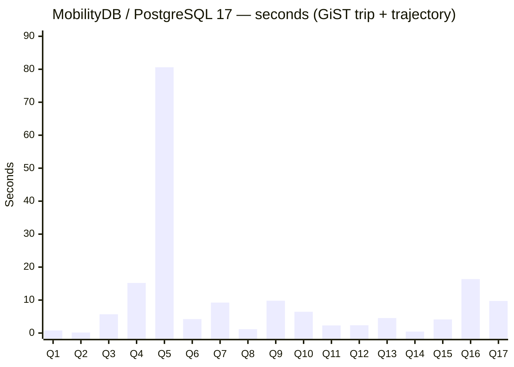
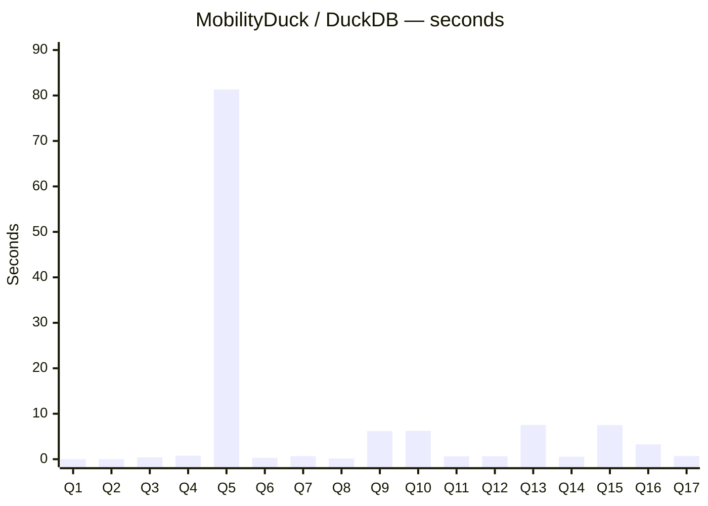

# Three-platform timing comparison — BerlinMOD 17 R-queries

**Date**: 2026-05-11
**Dataset**: BerlinMOD scalefactor 0.005, 1620 trips × 141 vehicles
**Hardware**: single-node WSL2 dev machine
**Runs**: 1 per query per platform
**Schema**: same generated CSV files on every platform; deterministic
`ORDER BY <PrimaryKey>` LIMIT-10 parameter views

Row counts are identical on every platform (the bench validates this
before reporting timings):

```
Q1:72  Q2:1  Q3:6  Q4:80  Q5:100  Q6:0  Q7:26  Q8:75  Q9:94
Q10:21 Q11:0 Q12:0 Q13:278 Q14:1  Q15:118 Q16:2 Q17:1
```

---

## Per-platform bar charts

### MobilityDB on PostgreSQL 17.8 — GiST(trip + trajectory)



### MobilityDuck on DuckDB — zone-map filtering



### MobilitySpark on Apache Spark 3.5 — `local[2]`

*In-progress at the time this document was generated.  Q1 and Q3
timed; remaining 15 queries still running.  Will refresh once the
bench completes.*

Available so far: Q1 = 0.36 s, Q3 = 90.16 s.

---

## Side-by-side detail (seconds; lower is better)

| Q | MobilityDB GiST | MobilityDuck | MobilitySpark |
|---|---:|---:|---:|
| Q1  |   0.78 |  0.01 |  0.36 |
| Q2  |   0.15 |  0.00 | (pending) |
| Q3  |   5.70 |  0.41 | 90.16 |
| Q4  |  15.19 |  0.79 | (pending) |
| Q5  |  80.61 | 81.34 | (pending) |
| Q6  |   4.23 |  0.31 | (pending) |
| Q7  |   9.24 |  0.68 | (pending) |
| Q8  |   1.18 |  0.14 | (pending) |
| Q9  |   9.81 |  6.19 | (pending) |
| Q10 |   6.46 |  6.24 | (pending) |
| Q11 |   2.31 |  0.62 | (pending) |
| Q12 |   2.37 |  0.65 | (pending) |
| Q13 |   4.55 |  7.54 | (pending) |
| Q14 |   0.44 |  0.54 | (pending) |
| Q15 |   4.13 |  7.49 | (pending) |
| Q16 |  16.35 |  3.28 | (pending) |
| Q17 |   9.74 |  0.70 | (pending) |
| **Total** | **173.23** | **125.12** | (pending) |

## Reading the chart

- **Q5 dominates the total** on both MobilityDB and MobilityDuck
  (~80 s each).  Source: `ST_Distance(ST_Collect(...), ST_Collect(...))`
  cross-join over the 10 × 10 licence groups.  Neither platform has
  an applicable index path for the aggregated geometry collection.
- **Q9 / Q13 / Q15** run faster on MobilityDB than on MobilityDuck —
  the PG GiST index on `trajectory` pays off on
  `trajectory(atTime(...))` predicates.
- **MobilityDuck wins on cheap queries** (Q1, Q2, Q3, Q4, Q6, Q7, Q8,
  Q11, Q12, Q14, Q17).  DuckDB's vectorized columnar engine has lower
  per-query overhead on small data, even without a spatial index.
- **Spark Q3 at 90 s** is dominated by JVM startup + per-query UDF FFI
  overhead.  Spark's row-at-a-time UDF dispatch for tgeompoint UDFs
  through JNR-FFI is a known per-row overhead.

## Reproduce

Per-platform driver scripts and matrix scripts:

- MobilityDB: [`run_full_bench.sh`](run_full_bench.sh)
- MobilityDuck: see [`MobilityDuck_rqueries_audit_2026-05-11.md`](MobilityDuck_rqueries_audit_2026-05-11.md)
- MobilitySpark: `BerlinMODBench <data_dir> <output.json> <runs>` in
  `MobilitySpark-parity/`.

Raw output: [`raw_output_rqueries_2026-05-11.txt`](raw_output_rqueries_2026-05-11.txt)
