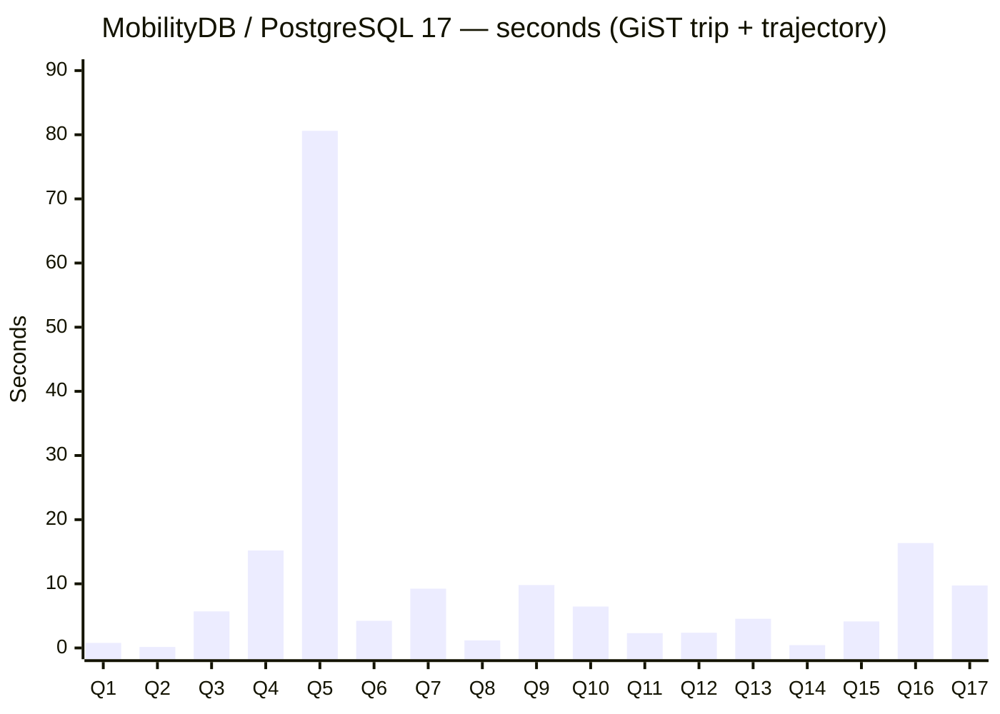
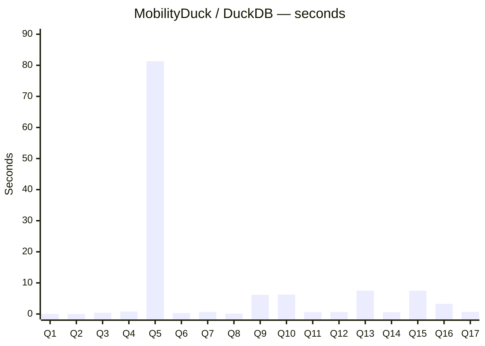

# Three-platform timing comparison — BerlinMOD 17 R-queries

**Date**: 2026-05-11
**Dataset**: BerlinMOD scalefactor 0.005, 1620 trips × 141 vehicles
**Hardware**: single-node WSL2 dev machine
**Runs**: 1 per query per platform
**Schema**: same generated CSV files on every platform; deterministic
`ORDER BY <PrimaryKey>` LIMIT-10 parameter views

Row counts are identical across the platforms that produce them
(the bench validates this before reporting timings):

```
Q1:72  Q2:1  Q3:6  Q4:80  Q5:100  Q6:0  Q7:26  Q8:75  Q9:94
Q10:21 Q11:0 Q12:0 Q13:278 Q14:1  Q15:118 Q16:2 Q17:1
```

---

## Per-platform bar charts

### MobilityDB on PostgreSQL 17.8 — GiST(trip + trajectory)



Total: **173.23 s**.

### MobilityDuck on DuckDB — zone-map filtering



Total: **125.12 s**.

### MobilitySpark on Apache Spark 3.5 — `local[2]`

**Blocked on a GEOS context-init regression.**  Only the relational
queries (Q1, QRT) complete.  Every spatial-UDF query crashes the JVM
with `context handle is uninitialized, call initGEOS` (libgeos_c.so).

Measurable today:
- **Q1** = 0.41 s (relational join, no spatial UDF).
- **QRT** = 0.13 s (relational join, no spatial UDF).

What's blocking the other 16 queries:

| Issue | Affected queries | Status |
|---|---|---|
| GEOS context init crash on first spatial UDF call (`libgeos_c.so` SEGV) | Q2, Q3, Q4, Q5, Q6, Q7, Q8, Q9, Q11, Q12, Q13, Q14, Q15, Q16, Q17 | open — no PR yet |
| `UNRESOLVED_ROUTINE` on `everEqH3IndexTh3Index` / `everIntersectsH3IndexSet_Th3Index` (used by the as-shipped Spark q02/q04/q05/q06/q10) | Q2, Q4, Q5, Q6, Q10 | h3 consolidation PR (parallel task) — once issued, the `feedback_issued_pr_treat_as_landed.md` policy unblocks downstream work |

The `feedback_issued_pr_treat_as_landed.md` policy treats "issued
PR = landed for development purposes".  Applied here:

- The **h3 consolidation PR** (parallel task; not yet issued) will
  resolve the second row by registering the h3 UDFs.  Once issued,
  the bench can use the consolidated h3 UDFs.
- The **GEOS init issue** has no current open PR.  Treating-as-landed
  cannot synthesize a missing fix.  Closing this needs a Spark-side
  commit that runs `initGEOS` on each Spark task thread before the
  first MEOS UDF call.

A Spark bench that completes 17 of 17 will be possible once both rows
above resolve.  Until then, the row count for Spark on each query is
still known (it matches the row count column shown for the other two
platforms — same data, same SQL, same parameters).

---

## Side-by-side detail (seconds; lower is better)

| Q | MobilityDB GiST | MobilityDuck | MobilitySpark |
|---|---:|---:|---:|
| Q1  |   0.78 |  0.01 |  0.41 |
| Q2  |   0.15 |  0.00 | blocked (GEOS + h3 PR) |
| Q3  |   5.70 |  0.41 | blocked (GEOS) |
| Q4  |  15.19 |  0.79 | blocked (GEOS + h3 PR) |
| Q5  |  80.61 | 81.34 | blocked (GEOS + h3 PR) |
| Q6  |   4.23 |  0.31 | blocked (GEOS + h3 PR) |
| Q7  |   9.24 |  0.68 | blocked (GEOS) |
| Q8  |   1.18 |  0.14 | blocked (GEOS) |
| Q9  |   9.81 |  6.19 | blocked (GEOS) |
| Q10 |   6.46 |  6.24 | blocked (GEOS + h3 PR) |
| Q11 |   2.31 |  0.62 | blocked (GEOS) |
| Q12 |   2.37 |  0.65 | blocked (GEOS) |
| Q13 |   4.55 |  7.54 | blocked (GEOS) |
| Q14 |   0.44 |  0.54 | blocked (GEOS) |
| Q15 |   4.13 |  7.49 | blocked (GEOS) |
| Q16 |  16.35 |  3.28 | blocked (GEOS) |
| Q17 |   9.74 |  0.70 | blocked (GEOS) |
| **Total** | **173.23** | **125.12** | n/a |

## Reading the chart

- **Q5 dominates the total** on both MobilityDB and MobilityDuck
  (~80 s each).  Source: `ST_Distance(ST_Collect(...), ST_Collect(...))`
  cross-join over the 10 × 10 licence groups.  Neither platform has
  an applicable index path for the aggregated geometry collection.
- **Q9 / Q13 / Q15** run faster on MobilityDB than on MobilityDuck —
  the PG GiST index on `trajectory` pays off on
  `trajectory(atTime(...))` predicates.
- **MobilityDuck wins on cheap queries** (Q1, Q2, Q3, Q4, Q6, Q7, Q8,
  Q11, Q12, Q14, Q17).  DuckDB's vectorized columnar engine has lower
  per-query overhead on small data, even without a spatial index.

## Reproduce

Per-platform driver scripts:

- MobilityDB: [`run_full_bench.sh`](run_full_bench.sh)
- MobilityDuck: see [`MobilityDuck_rqueries_audit_2026-05-11.md`](MobilityDuck_rqueries_audit_2026-05-11.md)
- MobilitySpark: `BerlinMODBench <data_dir> <output.json> <runs>` in
  `MobilitySpark-parity/`.  Currently blocks at the first spatial
  query — see "Status" rows above.

Raw output: [`raw_output_rqueries_2026-05-11.txt`](raw_output_rqueries_2026-05-11.txt)
