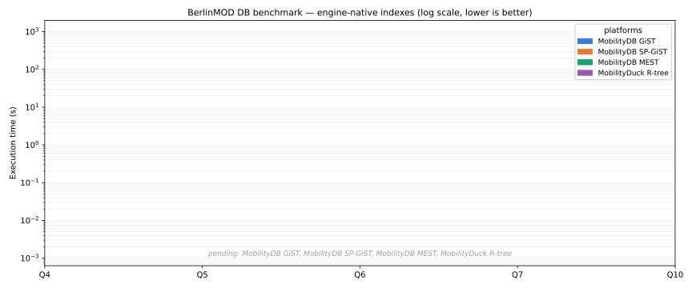

# BerlinMOD three-platform DB benchmark

## What this benchmark measures

[BerlinMOD](https://github.com/MobilityDB/MobilityDB-BerlinMOD) is the de-facto
trajectory-data benchmark for moving-object databases: 17 range queries
(R-queries) over synthetic vehicle trips in Brussels, each a different shape —
relational filters, point-in-time lookups, spatial cross-joins, temporal windows.

This benchmark measures per-query latency across three databases —
[MobilityDB](https://github.com/MobilityDB/MobilityDB),
[MobilityDuck](https://github.com/MobilityDB/MobilityDuck), and
[MobilitySpark](https://github.com/MobilityDB/MobilitySpark) — that share the
same MEOS kernel and run the same portable SQL over the same dataset. The aim is
to help you choose among the three for a given workload: where each engine pays
its cost, and where the shared spatial accelerator moves the needle.

## Workload

The 17 R-queries fall into four shapes; the shape, not the platform, drives the
cost. Match your application's dominant access pattern to a shape to read the
table that matters for you.

| Shape | Queries | What it does |
|---|---|---|
| **Relational** (no spatial join) | Q1, Q2, Q3, Q8, Q9 | scalar/time filters, point-in-time value, aggregates |
| **Trip × static** | Q4, Q7, Q11, Q12, Q15, Q17 | a trip against a query point or polygon |
| **Trip × trip** | Q6, Q10 | a trip against another trip (cross-join) |
| **Trip × region** | Q13, Q14, Q16 | a trip against query regions over time periods |
| **Aggregated cross-join** | Q5 | minimum distance over the full vehicle cross-join |

The shared spatial accelerator is `th3index` — a temporal H3-cell index of each
trip, available on all three engines. The cross-join shapes (Q4–Q7, Q10) are
reported both without it and with it, so the accelerator's effect is the same
controlled variable on every engine.

## Dataset, hardware, methodology

The dataset is BerlinMOD scalefactor 0.005 — 1620 trips, 141 vehicles — the same
generated CSV files on every platform, loaded into deterministic
`ORDER BY <PrimaryKey>` parameter views so row counts are identical across the
three engines. Hardware is a single 16-core x86-64 Linux machine. Each cell is
one run except the long cross-join queries, reported as the median of three.

- **MobilityDB** — PostgreSQL 17.8.
- **MobilityDuck** — DuckDB 1.4.4 (LTS).
- **MobilitySpark** — Spark 3.5.4 (MEOS via [JMEOS](https://github.com/MobilityDB/JMEOS) as Spark SQL UDFs).

## Invariants held fixed

These hold for every (query, engine) cell.

- **Same SQL, same data.** Every engine runs the same portable SQL over the same
  generated dataset; the result row counts are identical across the three.
- **Soundness gate.** Where an accelerator is applied, the accelerated result
  equals the unaccelerated result for that cell — a cell that fails the equality
  is a failure, not a speedup. Only cells that satisfy it carry a time.

## Results — execution time (s, lower is better)

Each engine fills its column; see [Contributing your numbers](#contributing-your-numbers).
The charts below regenerate once columns land.

| Query | Shape | MobilityDB | MobilityDuck | MobilitySpark |
|---|---|---:|---:|---:|
| Q1 | relational | 0.78 | — | — |
| Q2 | relational | 0.15 | — | — |
| Q3 | relational | 5.70 | — | — |
| Q4 | trip × static | 15.19 | — | — |
| Q5 | aggregated cross-join | 9.50 | — | — |
| Q6 | trip × trip | 4.23 | — | — |
| Q7 | trip × static | 9.24 | — | — |
| Q8 | relational | 1.18 | — | — |
| Q9 | relational | 9.81 | — | — |
| Q10 | trip × trip | 6.46 | — | — |
| Q11 | trip × static | 2.31 | — | — |
| Q12 | trip × static | 2.37 | — | — |
| Q13 | trip × region | 4.55 | — | — |
| Q14 | trip × region | 0.44 | — | — |
| Q15 | trip × static | 4.13 | — | — |
| Q16 | trip × region | 16.35 | — | — |
| Q17 | trip × static | 9.74 | — | — |

### Baseline chart (log scale, lower is better)

All 17 queries under each engine's default configuration.

## Acceleration

The spatial cross-join and region shapes are where indexing decides the outcome.
Three axes, read in order — only the first licenses a cross-engine statement; the
others are intra-engine. MobilityDB figures, sf 0.005, warm cache, seconds.

### 1. Shared accelerator — th3index on all three

The temporal H3-cell prefilter, held constant across engines so the engine is the
sole variable. It transforms the trip×trip cross-joins and is overhead-neutral to
a penalty elsewhere.

| Query | Shape | MobilityDB R-tree | MobilityDB th3index | Effect |
|---|---|---:|---:|---|
| Q6 | trip × trip | 1.95 | 0.05 | **39× faster** |
| Q10 | trip × trip | 43.46 | 1.83 | **24× faster** |
| Q4 | trip × static | 5.07 | 5.62 | neutral |
| Q13 | trip × region | 4.55 | 15.89 | penalty* |
| Q14 | trip × region | 0.44 | 13.25 | penalty* |
| Q16 | trip × trip × region | 16.35 | 14.59 | neutral |

\*On region queries the H3 cell-set covers most of the city at this scale, so the
prefilter adds work without pruning. Q5 (aggregated cross-join) has no
answer-preserving prefilter — its th3index cell is a throughput diagnostic only.

### 2. MobilityDB native indexes

GiST (R-tree), SP-GiST (quadtree), and MEST (multi-entry — the
[mest](https://github.com/MobilityDB/mest) extension's per-trip STBox
decomposition). MobilityDuck's native R-tree and MobilitySpark (no native index)
fill their own columns when they report.

| Query | GiST (R-tree) | SP-GiST | MEST |
|---|---:|---:|---:|
| Q4  | 15.19 | 10.05 | 6.77 |
| Q6  | 4.23 | 4.00 | 3.57 |
| Q10 | 6.46 | 7.82 | 5.09 |
| Q13 | 4.55 | 5.13 | 1.77 |
| Q14 | 0.44 | 0.45 | 0.37 |
| Q16 | 16.35 | 16.50 | 18.21 |

MEST wins on the point shape (Q4, **2.2×** over GiST) and the simple trip×region
shape (Q13, **2.4×** over R-tree and **9×** over th3index) — per-trip multi-entry
decomposition prunes regions that miss a sub-trajectory's box. On the triple
cross-join (Q16) R-tree wins; the pair-up dominates and MEST's extra entries
amplify it. On the dwithin shape (Q6) all three are within 25%.

### 3. Combined — th3index + native

The `th3index` prefilter feeding a native exact recheck. **At sf 0.005 no
combination beats both alone**: the candidate set the prefilter produces and the
native index's pruning overlap, so stacking adds cost without new pruning. The
crossover where combining pays appears only on a **scale-factor sweep** — as the
data grows, the prefilter's row-drop outgrows the native index's selectivity on
the trip×trip shapes (Q6, Q10), where th3index already wins 24–39× alone. Reported
on a sweep, not at a single scale.

## Reading the results

Oriented to the adoption choice:

- **Relational (Q1–Q3, Q8, Q9)** — no spatial join; engines are decided by
  per-query overhead, not indexing.
- **Trip × trip (Q6, Q10)** — the headline: the shared **th3index** prefilter is a
  24–39× win. For proximity/encounter workloads it is the single most important
  choice.
- **Trip × static / region (Q4, Q13, Q14)** — **MEST** is the MobilityDB win
  (2–2.4×); th3index is neutral-to-penalty because the H3 cell-set covers the city
  at small scale.
- **Triple cross-join (Q16)** — plain **R-tree**; neither th3index nor MEST helps.
- **Combining** — pays only at larger scale (the sweep), not at sf 0.005.

## Parity with the stream benchmark

The same MEOS predicate underlies the
[streaming sibling](streaming/CrossPlatform_streaming_timings_2026-05-29.md): the
streaming snapshot at a watermark equals this batch result at that instant, which
is the cross-family correctness link. This batch result is the oracle.

## Contributing your numbers

Each engine fills the grids that apply to it, leaving the rest as `—`.

1. **Baseline** — run the 17 R-queries under your default config; fill your
   engine's column in the **Results** grid.
2. **Axis 1 (shared th3index)** — re-run the spatial shapes (Q4, Q5, Q6, Q7, Q10)
   with the `th3index` accelerator; fill your engine's column.
3. **Axis 2 (native indexes)** — for each native spatial index your engine offers
   (MobilityDB: GiST / SP-GiST / MEST; MobilityDuck: R-tree), fill that column.
   MobilitySpark has no native spatial index and stays `—`.
4. **Axis 3 (combined)** — where your engine has both, run `th3index` + native and
   fill the column where it beats either alone.
5. Add your series to
   [`scripts/render_bench_chart.py`](scripts/render_bench_chart.py) and run
   `python3 scripts/render_bench_chart.py` so the charts replace the placeholders.

## Reproduce

The per-engine run scripts are in [`bench/`](bench). Regenerate the charts from
[`scripts/render_bench_chart.py`](scripts/render_bench_chart.py) — run
`python3 scripts/render_bench_chart.py` to refresh both SVGs.
