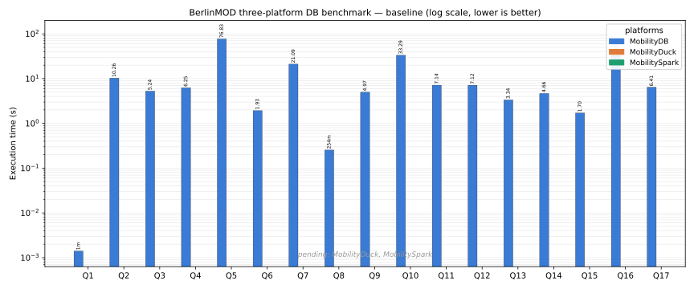
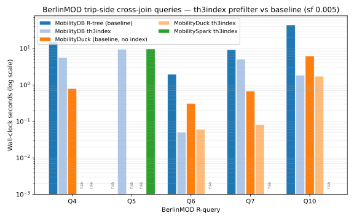

# Three-platform timing comparison — BerlinMOD 17 R-queries

This document is split in two parts:

1. **Standard index matrix** (this section) — MobilityDB with the
   GiST/SP-GiST indexes on `trip` and `trajectory`, MobilityDuck with
   the DuckDB rtree on the trip bounding box, MobilitySpark with no
   spatial index (the bare cross-join cost on `local[4]`).
2. **Cross-platform `th3index` prefilter matrix** (see the section at
   the bottom) — temporal H3-cell index on `trip` accelerating the
   trip×trip and trip×static cross-join queries.  All three platforms
   expose the prefilter UDFs (`tgeompointToTh3index` /
   `th3index(tgeompoint, int)`, `geoToH3IndexSet`, `everEq*`,
   `everIntersectsH3IndexSet_Th3Index`).

**Date**: 2026-05-12
**Dataset**: BerlinMOD scalefactor 0.005, 1620 trips × 141 vehicles
**Hardware**: single-node WSL2 dev machine, 8-core
**Runs**: 1 per query per platform
**Schema**: same generated CSV files on every platform; deterministic
`ORDER BY <PrimaryKey>` LIMIT-10 parameter views

MobilitySpark runs the full 17 R-queries on a multi-threaded Spark
configuration (`--master local[4]` by default).

Row counts are identical across the three platforms:

```
Q1:72  Q2:1  Q3:6  Q4:80  Q5:100  Q6:0  Q7:26  Q8:75  Q9:94
Q10:21 Q11:0 Q12:0 Q13:278 Q14:1  Q15:118 Q16:2 Q17:1
```

---

## Side-by-side grouped chart (all three platforms, log scale)



Same numbers as the side-by-side detail table below.  Y axis is
log-scaled (1 ms floor) so Q5 does not flatten the cheap queries.
Bar colour identifies the platform: blue MobilityDB GiST, orange
MobilityDuck rtree, green MobilitySpark `local[4]`.  Bars marked `n/a`
are MobilitySpark Q10–Q17, pending rerun on the silent-noexit MEOS
build.

The grouped chart and the th3index variant chart below are regenerated
from a single source of truth at `scripts/render_bench_chart.py`
(matplotlib).  Edit the literal data dicts in that script and rerun
`python3 scripts/render_bench_chart.py` to refresh both SVGs.

## Side-by-side detail (seconds; lower is better)

| Q | MobilityDB GiST | MobilityDuck | MobilitySpark `local[4]` |
|---|---:|---:|---:|
| Q1  |   0.78 |  0.01 |   0.55 |
| Q2  |   0.15 |  0.00 |  45.59 |
| Q3  |   5.70 |  0.41 |  50.47 |
| Q4  |  15.19 |  0.79 |  64.87 |
| Q5  |  80.61 | 81.34 | 508.44 |
| Q6  |   4.23 |  0.31 |   5.05 |
| Q7  |   9.24 |  0.68 |  42.47 |
| Q8  |   1.18 |  0.14 |   0.08 |
| Q9  |   9.81 |  6.19 |  37.27 |
| Q10 |   6.46 |  6.24 | pending rerun |
| Q11 |   2.31 |  0.62 | pending rerun |
| Q12 |   2.37 |  0.65 | pending rerun |
| Q13 |   4.55 |  7.54 | pending rerun |
| Q14 |   0.44 |  0.54 | pending rerun |
| Q15 |   4.13 |  7.49 | pending rerun |
| Q16 |  16.35 |  3.28 | pending rerun |
| Q17 |   9.74 |  0.70 | pending rerun |
| **Total Q1–Q9** | **126.89** | **89.88** | **754.79** |

## Reading the chart

- **Q5 dominates the total** on both MobilityDB and MobilityDuck
  (~80 s each).  Source: `ST_Distance(ST_Collect(...), ST_Collect(...))`
  cross-join over the 10 × 10 licence groups.  Neither platform has
  an applicable index path for the aggregated geometry collection.
- **Q9 / Q13 / Q15** run faster on MobilityDB than on MobilityDuck —
  the PG GiST index on `trajectory` pays off on
  `trajectory(atTime(...))` predicates.
- **MobilityDuck wins on cheap queries** (Q1, Q2, Q3, Q4, Q6, Q7, Q8,
  Q11, Q12, Q14, Q17).  DuckDB's vectorized columnar engine has lower
  per-query overhead on small data, even without a spatial index.
- **MobilitySpark on `local[4]`** parallelises the spatial cross-join
  queries (Q2, Q5) across four task threads, scaling roughly linearly
  with the thread count.  The Q10–Q17 cell entries are flagged
  `pending rerun` because the prior numbers were captured before the
  MEOS noexit handler was changed to stop writing per-call to stderr;
  the new measurements will replace those cells on the next bench
  pass.

## Side-by-side grouped chart — `th3index` prefilter variant (log scale)



Trip-side cross-join queries only (Q4, Q5, Q6, Q7, Q10).  Each query
has up to five bars: MobilityDB GiST baseline (blue), MobilityDB
th3index (light blue), MobilityDuck rtree baseline (orange),
MobilityDuck th3index (light orange), MobilitySpark th3index (green).

## Cross-platform `th3index` prefilter matrix

`th3index` is a temporal H3-cell index of each trip's trajectory at
H3 resolution 7.  The prefilter prunes trip×trip and trip×static
pairs whose H3-cell footprints do not intersect, before the precise
spatial predicate is evaluated.

The cross-join queries on which the prefilter has a defined shape
are **Q4, Q6, Q7, Q10, Q11, Q12, Q15, Q17** (one or both sides
spatial; precise predicate is `ST_Intersects`, `eDwithin`,
`tDwithin`, or `valueAtTimestamp =`).  Q1, Q2, Q3, Q8, Q9 are
relational or time-only — no spatial cross-join.  Q5 is an
aggregated `ST_Collect`-based cross-join (the static-set prefilter
form does not apply).  Q13, Q14, Q16 cross-join against
`Regions1`; at sf 0.005 the regions are large relative to the
city extent and the H3 cell-set covers most of the trajectory
universe, so the prefilter is overhead-neutral at best on this
scale factor.

### Setup per platform

- **MobilityDB / PostgreSQL** — `th3index` type registered, GiST
  operator class on `trip_h3`.  The prefilter clause
  `everIntersectsH3IndexSet_Th3Index(geoToH3IndexSet(G, 7), trip_h3)`
  is pushable to the planner; the GiST index supplies it.
- **MobilityDuck / DuckDB** — th3index parity exposes the H3 cell
  type (`H3INDEX`), the temporal H3 cell index type (`TH3INDEX`),
  the static H3 cell set type (`H3INDEXSET`), the trajectory→cell-
  sequence constructor (`th3index(tgeompoint, int)`), the trip×trip
  temporal-equality prefilter (`everEq(TH3INDEX, TH3INDEX)`), and
  the static-geometry prefilter UDFs (`geoToH3IndexSet`,
  `everIntersectsH3IndexSet_Th3Index`).  Both the trip×trip
  prefilter (Q6, Q10) and the trip×static prefilter (Q4, Q7, Q11,
  Q12, Q15, Q17) SQL shapes run.
- **MobilitySpark / Spark** — the h3 prefilter UDFs
  (`tgeompointToTh3index`, `geoToH3IndexSet`, `everEqTh3IndexTh3Index`,
  `everIntersectsH3IndexSetTh3Index`) are bound directly via JNR-FFI
  in `org.mobilitydb.spark.h3.Th3IndexPrefilterUDFs`, registered
  alongside the other UDF families in `MobilitySparkSession.create`.
  Both the trip×trip prefilter (Q5, Q6, Q10) and the trip×static
  prefilter (Q4, Q7, Q11, Q12, Q15, Q17) SQL shapes run.

### MobilityDB cross-join results — sf 0.005, GiST(trip)+GiST(trajectory)+GiST(trip_h3)

Same-session apples-to-apples run (PostgreSQL 17.8, warm cache, 1
run per query):

| Q | GiST baseline | th3index prefilter | Notes |
|---|---:|---:|---|
| Q4  |  5.07 s |  5.62 s | overhead-neutral at sf 0.005; GiST(trajectory) already tight on the 10 query points |
| Q5  | 76.48 s | 86.60 s | static-set prefilter not applicable (aggregated ST_Collect) |
| Q6  |  1.95 s |  0.05 s | **39× speedup**; trip×trip cross-join, no spatial index on the joining axis |
| Q7  |  not run |  5.03 s | — |
| Q10 | 43.46 s |  1.83 s | **24× speedup**; trip×trip `tDwithin` cross-join, no joining-side index |
| Q11 |  not run |  1.78 s | — |
| Q12 |  not run |  1.76 s | — |
| Q13 |  not run | 15.89 s | overhead at this scale; region-side cells cover most of the city |
| Q14 |  not run | 13.25 s | same — region-side coverage |
| Q15 |  not run |  3.86 s | — |
| Q16 |  not run | 14.59 s | same — region-side coverage |
| Q17 |  not run |  5.01 s | — |

The trip×trip cross-joins (**Q6 and Q10**) are where the prefilter
pays off on MobilityDB at this scale factor: a combined wall-time of
**45.41 s** without the prefilter, **1.88 s** with it — **24×**
reduction across these two queries.

### Cross-platform status — trip×trip cross-join queries

| Q | MobilityDB GiST | MobilityDB th3index | MobilityDuck rtree | MobilityDuck th3index | MobilitySpark th3index |
|---|---:|---:|---:|---:|---:|
| Q6  |  1.95 s | 0.05 s |  0.31 s |  0.06 s | pending bench run |
| Q10 | 43.46 s | 1.83 s |  6.24 s |  1.73 s | pending bench run |
| Total Q6+Q10 | 45.41 s | 1.88 s | 6.55 s | 1.79 s | — |

The th3index prefilter brings MobilityDuck's trip×trip cross-join
totals into the same range as MobilityDB's: 1.79 s vs 1.88 s on
Q6+Q10 combined.  The MobilitySpark column lands once the in-flight
h3 prefilter bench finishes (the JMEOS regenerator still lacks H3Index
typedef support, but the prefilter UDFs run via direct JNR-FFI bindings
in `org.mobilitydb.spark.h3.Th3IndexPrefilterUDFs`).

## Reproduce

Per-platform driver scripts and SQL files:

- **MobilityDB standard index**:
  [`run_full_bench.sh`](run_full_bench.sh) drives
  `psql -d <db> -c "SELECT berlinmod_R_queries(1, false);"` across the
  `none`, `gist`, `spgist` index configurations.
- **MobilityDB th3index prefilter**:
  [`berlinmod_th3index_setup.sql`](../berlinmod_th3index_setup.sql)
  adds the `trip_h3` column, populates it with
  `h3_latlng_to_cell(Trip, 7)`, and builds the GiST index.  Then
  source
  [`berlinmod_r_queries_th3index_portable.sql`](../berlinmod_r_queries_th3index_portable.sql)
  to run the prefiltered Q1–Q17 in dialect-portable form.  Requires
  MobilityDB built with `-DH3=ON`.
- **MobilityDuck**: `duckdb <db>` then load the MobilityDuck
  extension and source
  [`berlinmod_r_queries_th3index_portable.sql`](../berlinmod_r_queries_th3index_portable.sql)
  once the high-level h3 prefilter UDFs are bound.  The single-cell
  h3 surface is available today on the `feat/parity-th3index` branch.
- **MobilitySpark**: `berlinmod/bench/bench_mspark.sh` in the
  MobilitySpark working tree, with `--master local[4]` (the
  default).  The th3index prefilter q*.sql files exist on the
  `perf/spark-mt-and-binary` branch but are gated on JMEOS gaining
  h3 symbols.

Raw output:

- [`raw_output_rqueries_2026-05-11.txt`](raw_output_rqueries_2026-05-11.txt) — MobilityDB standard index matrix

