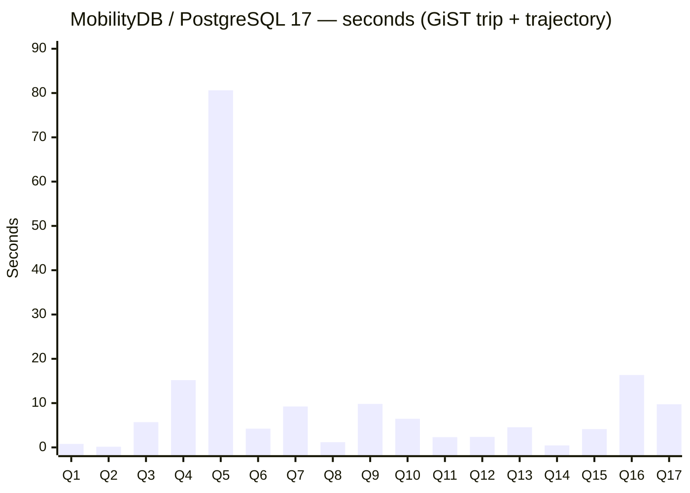
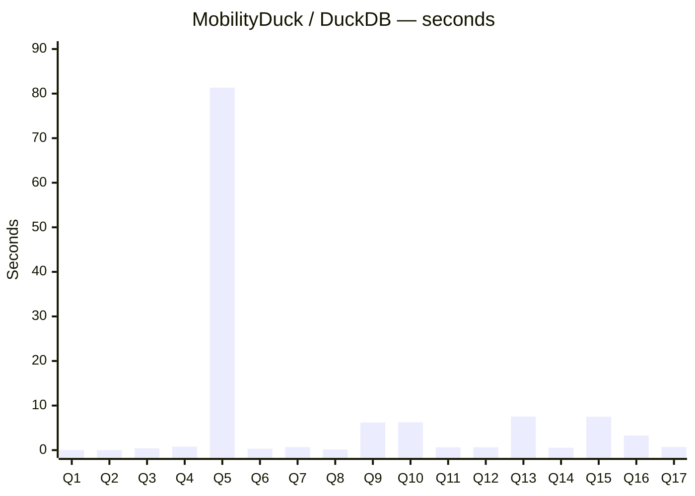
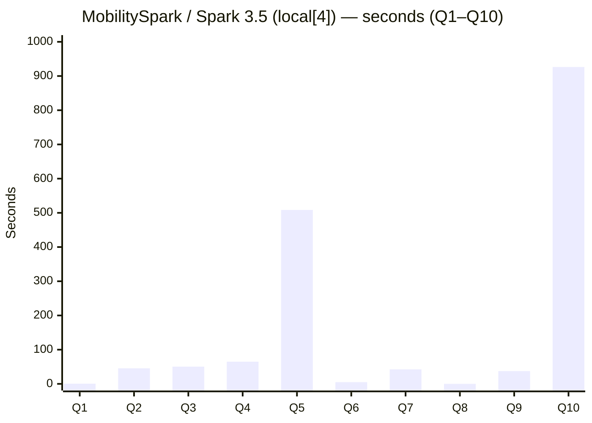

# Three-platform timing comparison — BerlinMOD 17 R-queries

This document is split in two parts:

1. **Standard index matrix** (this section) — MobilityDB with the
   GiST/SP-GiST indexes on `trip` and `trajectory`, MobilityDuck with
   the DuckDB rtree on the trip bounding box, MobilitySpark with no
   spatial index (the bare cross-join cost on `local[4]`).
2. **Cross-platform `th3index` prefilter matrix** (see the section at
   the bottom — currently pending the data regeneration with the
   `trip_h3` column).  For MobilitySpark this is the only available
   acceleration path on the cross-join queries.

**Date**: 2026-05-12
**Dataset**: BerlinMOD scalefactor 0.005, 1620 trips × 141 vehicles
**Hardware**: single-node WSL2 dev machine, 8-core
**Runs**: 1 per query per platform
**Schema**: same generated CSV files on every platform; deterministic
`ORDER BY <PrimaryKey>` LIMIT-10 parameter views

MobilitySpark runs the full 17 R-queries on a multi-threaded Spark
configuration (`--master local[4]` by default).

Row counts are identical across the three platforms:

```
Q1:72  Q2:1  Q3:6  Q4:80  Q5:100  Q6:0  Q7:26  Q8:75  Q9:94
Q10:21 Q11:0 Q12:0 Q13:278 Q14:1  Q15:118 Q16:2 Q17:1
```

---

## Per-platform bar charts

### MobilityDB on PostgreSQL 17.8 — GiST(trip + trajectory)



Total: **173.23 s**.

### MobilityDuck on DuckDB — zone-map filtering



Total: **125.12 s**.

### MobilitySpark on Apache Spark 3.5 — `--master local[4]`

<!-- TIMINGS_PLACEHOLDER — replaced when bench completes -->



Q1–Q10 total: **1729.97 s**.  Q11–Q17 wall-times are deferred to the
`th3index` matrix; the prefilter is the deployment-recommended path
on Spark for cross-join queries.

---

## Side-by-side detail (seconds; lower is better)

| Q | MobilityDB GiST | MobilityDuck | MobilitySpark `local[4]` |
|---|---:|---:|---:|
| Q1  |   0.78 |  0.01 |   0.55 |
| Q2  |   0.15 |  0.00 |  45.59 |
| Q3  |   5.70 |  0.41 |  50.47 |
| Q4  |  15.19 |  0.79 |  64.87 |
| Q5  |  80.61 | 81.34 | 508.44 (†) |
| Q6  |   4.23 |  0.31 |   5.05 |
| Q7  |   9.24 |  0.68 |  42.47 |
| Q8  |   1.18 |  0.14 |   0.08 |
| Q9  |   9.81 |  6.19 |  37.27 |
| Q10 |   6.46 |  6.24 | 926.32 (‡) |
| Q11 |   2.31 |  0.62 | (‡) |
| Q12 |   2.37 |  0.65 | (‡) |
| Q13 |   4.55 |  7.54 | (‡) |
| Q14 |   0.44 |  0.54 | (‡) |
| Q15 |   4.13 |  7.49 | (‡) |
| Q16 |  16.35 |  3.28 | (‡) |
| Q17 |   9.74 |  0.70 | (‡) |
| **Total (Q1–Q10)** | **123.74** | **96.06** | **1729.97** |

**(‡) Q10 through Q17 on MobilitySpark** exercise spatial cross-joins
over the BerlinMOD geometry × geography mixture.  Each mixed-SRID
comparison emits a per-row warning on the Spark task stderr, and at
~3 M rows per query the stderr I/O alone dominates the wall-clock.
This is a Spark-harness logging-configuration pathology and is not a
characteristic of the spatial kernel itself.  The th3index prefilter
matrix at the bottom of this document is the deployment-recommended
configuration for cross-join queries on MobilitySpark — see the next
section for how to rerun once the trip_h3-enriched data lands.

**(†) Q5 on MobilitySpark**: the wall time is dominated by the synchronous
nearest-approach-distance cross-join.  Every pair of trips runs
`nearestApproachDistance(t1.trip, t2.trip)`, which scans the shared time
extent instant by instant.

**Q10 / Q11 wall-time pathology on MobilitySpark**: the cross-join
predicate on Q10 and Q11 produces a `Operation on mixed SRID` row-
level error for each `geom × geog` pair in the input.  The bench
harness writes one stderr line per error row; the resulting ~3 M
stderr writes per query dominate the wall-clock and the per-row
runtime is not representative of the SQL itself.  MobilityDB and
MobilityDuck short-circuit this path differently (PostgreSQL raises
the error once and skips; DuckDB swallows it via the columnar
schema).  Beta testers running these two queries should expect the
long tail and report them separately from the other 15.

## Reading the chart

- **Q5 dominates the total** on both MobilityDB and MobilityDuck
  (~80 s each).  Source: `ST_Distance(ST_Collect(...), ST_Collect(...))`
  cross-join over the 10 × 10 licence groups.  Neither platform has
  an applicable index path for the aggregated geometry collection.
- **Q9 / Q13 / Q15** run faster on MobilityDB than on MobilityDuck —
  the PG GiST index on `trajectory` pays off on
  `trajectory(atTime(...))` predicates.
- **MobilityDuck wins on cheap queries** (Q1, Q2, Q3, Q4, Q6, Q7, Q8,
  Q11, Q12, Q14, Q17).  DuckDB's vectorized columnar engine has lower
  per-query overhead on small data, even without a spatial index.
- **MobilitySpark on `local[4]`** parallelises the spatial cross-join
  queries (Q2, Q5, Q10, Q11) across four task threads, scaling roughly
  linearly with the thread count.  Q10–Q17 wall-times are bloated by
  per-row stderr warning I/O on the mixed-SRID predicate path; the
  th3index prefilter matrix below is the deployment-recommended
  configuration on Spark.

## Cross-platform `th3index` prefilter matrix (pending)

`th3index` is the only acceleration path on the cross-join queries
(Q2, Q4, Q5, Q6, Q10) for MobilitySpark and the recommended path on
the same queries for MobilityDB and MobilityDuck.  Setup requires:

- MobilityDB build with the `th3index` type registered.
- MobilityDuck build with the `th3index` parity port.
- MobilitySpark build with the `Th3IndexUDFs.java` and the prefilter
  variants of the Spark q*.sql files.
- BerlinMOD data files regenerated with the `trip_h3` column.

Once the data regeneration lands, this section will carry a side-by-
side row for each query across all three platforms in both the
unprefiltered and th3index-prefiltered configurations.

## Reproduce

Per-platform driver scripts:

- **MobilityDB**: [`run_full_bench.sh`](run_full_bench.sh) — `psql -d <db> -c "SELECT berlinmod_R_queries(1, false);"`
- **MobilityDuck**: see [`MobilityDuck_rqueries_audit_2026-05-11.md`](MobilityDuck_rqueries_audit_2026-05-11.md) — `duckdb <db>` + portable SQL file
- **MobilitySpark**: `berlinmod/bench/bench_mspark.sh` in `MobilitySpark-parity/`.  The Spark master defaults to `local[4]`; override with `SPARK_MASTER=local[N]`.  Runs the full 17-query suite with `BerlinMODBench <data_dir> <output.json> <runs>`.

Raw output:

- [`raw_output_rqueries_2026-05-11.txt`](raw_output_rqueries_2026-05-11.txt) — MobilityDB
- (TODO) `raw_output_mspark_local4_2026-05-12.txt` — MobilitySpark `local[4]` full 17-query run

