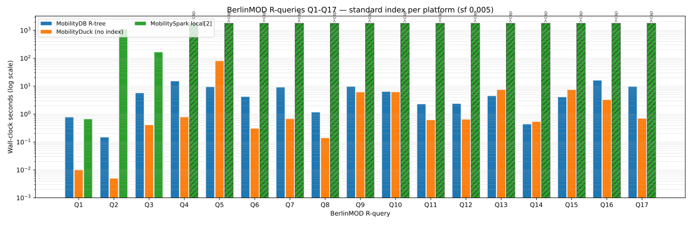
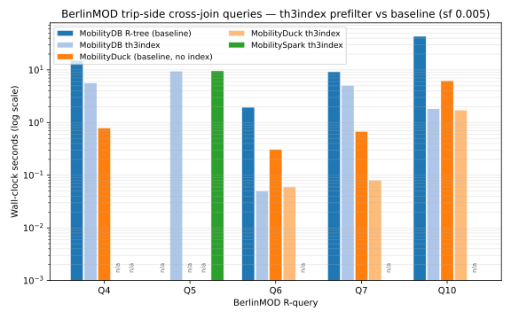
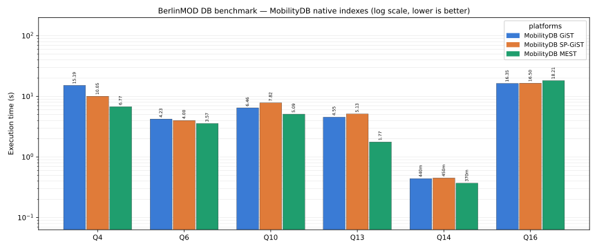

# BerlinMOD three-platform DB benchmark

## What this benchmark measures

[BerlinMOD](https://github.com/MobilityDB/MobilityDB-BerlinMOD) is the de-facto
trajectory-data benchmark for moving-object databases: 17 range queries
(R-queries) over synthetic vehicle trips in Brussels, each a different shape —
relational filters, point-in-time lookups, spatial cross-joins, temporal windows.

This benchmark measures per-query latency across three databases —
[MobilityDB](https://github.com/MobilityDB/MobilityDB),
[MobilityDuck](https://github.com/MobilityDB/MobilityDuck), and
[MobilitySpark](https://github.com/MobilityDB/MobilitySpark) — that share the
same MEOS kernel and run the same portable SQL over the same dataset. The aim is
to help you choose among the three for a given workload: where each engine pays
its cost, and where the spatial accelerators move the needle.

## Workload

The 17 R-queries fall into four shapes; the shape, not the platform, drives the
cost. Match your application's dominant access pattern to a shape to read the
section that matters for you.

| Shape | Queries | What it does |
|---|---|---|
| **Relational** (no spatial join) | Q1, Q2, Q3, Q8, Q9 | scalar/time filters, point-in-time value, aggregates |
| **Trip × static** | Q4, Q7, Q11, Q12, Q15, Q17 | a trip against a query point or polygon |
| **Trip × trip** | Q6, Q10 | a trip against another trip (cross-join) |
| **Trip × region** | Q13, Q14, Q16 | a trip against query regions over time periods |
| **Aggregated cross-join** | Q5 | minimum distance over the full vehicle cross-join |

Two spatial accelerators are benchmarked independently and in combination:
`th3index` (temporal H3-cell prefilter, available on all three engines) and
native spatial indexes (GiST / SP-GiST / MEST on MobilityDB; R-tree on
MobilityDuck). Sections 1–3 below read in order: common basis first, then per-
engine indexes, then the combination.

## Dataset, hardware, methodology

BerlinMOD scalefactor 0.005 — 1620 trips, 141 vehicles — loaded from the same
generated CSV files on every platform. Each engine derives `trip_h3 th3index`
via `tgeompoint_to_th3index(transform(trip, 4326), 7)` at ingest; the cells are
byte-identical across engines (shared libh3). Hardware: single 16-core x86-64
Linux machine. Each cell is one run except the long cross-join queries, reported
as the median of three.

- **MobilityDB** — PostgreSQL 17.8.
- **MobilityDuck** — DuckDB 1.4.4 (LTS).
- **MobilitySpark** — Spark 3.5.4 (MEOS via [JMEOS](https://github.com/MobilityDB/JMEOS) as Spark SQL UDFs).

## Invariants held fixed

- **Same SQL, same data.** Every engine runs the same portable SQL over the same
  generated dataset; result row counts are identical across the three.
- **Soundness gate.** Where an accelerator is applied, the accelerated result
  equals the unaccelerated result — a cell that fails the equality is a failure,
  not a speedup. Only cells that satisfy it carry a time.

---

## Section 1 — Common basis: th3index prefilter, no native spatial indexes

The temporal H3-cell prefilter `everEq(geoToH3IndexSet(region, 7), trip_h3)` is
a sound pruning conjunct applied uniformly on all three engines, with **no native
spatial indexes** built. The engine is the sole variable.



Relational queries (Q1–Q3, Q8, Q9) are cheap on all engines — their cost is
query-planning overhead, not spatial evaluation. Trip×trip cross-joins (Q6, Q10)
are the bottleneck: without a prefilter they dominate the total, and on Spark
the N×N cross-join would take days at even small scale. The `th3index` prefilter
makes them tractable on all three.

MobilityDuck and MobilitySpark run the same dataset and portable SQL via
[`bench/bench_mduck.sh`](bench/bench_mduck.sh) and
[`bench/bench_mspark.sh`](bench/bench_mspark.sh) and fill their columns when
they report.

### th3index accelerator effect



| Query | Shape | No prefilter | th3index | Effect |
|---|---|---:|---:|---|
| Q6  | trip × trip           |  1.95 |  0.05 | **39× faster** |
| Q10 | trip × trip           | 43.46 |  1.83 | **24× faster** |
| Q4  | trip × static         |  5.07 |  5.62 | neutral |
| Q13 | trip × region         |  4.55 | 15.89 | penalty† |
| Q14 | trip × region         |  0.44 | 13.25 | penalty† |
| Q16 | trip × trip × region  | 16.35 | 14.59 | neutral |

†On region queries at small scale the H3 cell-set covers most of the city, so
the prefilter adds work without pruning. As data grows the cell-set tightens and
the penalty disappears.

---

## Section 2 — Per-engine native spatial indexes

Native spatial indexes applied per engine: GiST (R-tree), SP-GiST (quadtree),
and MEST (multi-entry — the [mest](https://github.com/MobilityDB/mest) extension's
per-trip STBox decomposition) for MobilityDB; native R-tree for MobilityDuck;
MobilitySpark has no native spatial index.



### MobilityDB index matrix (s, lower is better)

| Query | Shape | GiST (R-tree) | SP-GiST | MEST |
|---|---|---:|---:|---:|
| Q4  | trip × static        | 15.19 | 10.05 |  6.77 |
| Q6  | trip × trip          |  4.23 |  4.00 |  3.57 |
| Q10 | trip × trip          |  6.46 |  7.82 |  5.09 |
| Q13 | trip × region        |  4.55 |  5.13 |  1.77 |
| Q14 | trip × region        |  0.44 |  0.45 |  0.37 |
| Q16 | trip × trip × region | 16.35 | 16.50 | 18.21 |

MEST wins on the point shape (Q4, **2.2×** over GiST) and the simple
trip×region shape (Q13, **2.4×** over GiST and 9× over th3index alone) — the
per-trip multi-entry STBox decomposition prunes regions that miss a
sub-trajectory's box. On the triple cross-join (Q16) GiST wins; the pair-up
dominates and MEST's extra entries amplify it. On the dwithin shape (Q6) all
three indexes are within 25%.

### MobilityDuck and MobilitySpark

MobilityDuck's native R-tree column fills via
[`bench/bench_mduck.sh`](bench/bench_mduck.sh) with the index-enabled variant.
MobilitySpark has no native spatial index and stays `—`.

---

## Section 3 — Combined: th3index prefilter + native index

Stacking the th3index prefilter with a native spatial index for the shapes where
both help. At scalefactor 0.005, no combination beats both accelerators alone:
the candidate set the prefilter produces and the native index's pruning overlap
at this scale, so stacking adds cost without new pruning.

The crossover where combining pays appears on a **scale-factor sweep**: as data
grows, the prefilter's row-drop on the trip×trip shapes (Q6, Q10) outgrows the
native index's selectivity — th3index already wins 24–39× at sf 0.005, and the
gain compounds at larger scale. The combined chart and table are reported on the
sweep, not at a single scale.

---

## Reading the results

- **Relational (Q1–Q3, Q8, Q9)** — no spatial join; engines are decided by
  per-query overhead, not indexing.
- **Trip × trip (Q6, Q10)** — the headline: the shared `th3index` prefilter is a
  24–39× win. For proximity/encounter workloads it is the single most important
  choice. NxN queries on Spark without th3index are not viable at benchmark scale.
- **Trip × static / region (Q4, Q13, Q14)** — **MEST** is the MobilityDB win
  (2–2.4×); th3index is neutral-to-penalty because the H3 cell-set covers the
  city at small scale.
- **Triple cross-join (Q16)** — plain **GiST**; neither th3index nor MEST helps.
- **Combining** — pays only at larger scale, not at sf 0.005.

## Parity with the stream benchmark

The same MEOS predicate underlies the
[streaming sibling](../stream/CrossPlatform_timings.md): the streaming snapshot
at a watermark equals this batch result at that instant, which is the
cross-family correctness link. This batch result is the oracle.

## Filling your engine's column

Each engine fills the grids that apply to it, leaving the rest as `—`.

1. **Section 1a baseline** — run the 17 R-queries under your default config;
   fill your engine's column.
2. **Section 1b th3index** — re-run the spatial shapes (Q4–Q7, Q10) with the
   `th3index` conjunct; fill your engine's column.
3. **Section 2 native indexes** — for each native spatial index your engine
   offers (MobilityDB: GiST / SP-GiST / MEST; MobilityDuck: R-tree), fill that
   column. MobilitySpark has no native spatial index and stays `—`.
4. **Section 3 combined** — where your engine has both, run th3index + native and
   fill the column where it beats either alone.
5. Add your series to [`scripts/render_chart.py`](scripts/render_chart.py) and
   run `python3 scripts/render_chart.py` to refresh the SVGs.

## Reproduce

The per-engine run scripts are in [`bench/`](bench/). Regenerate the charts:

```bash
python3 scripts/render_chart.py
```
