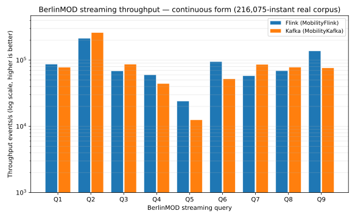
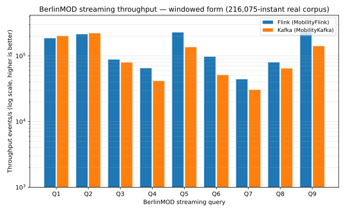
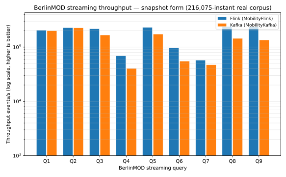

# BerlinMOD three-platform stream benchmark

## What this benchmark measures

Per-query throughput of the BerlinMOD streaming query set across three stream
engines — [MobilityFlink](https://github.com/MobilityDB/MobilityFlink),
[MobilityKafka](https://github.com/MobilityDB/MobilityKafka), and
[MobilityNebula](https://github.com/MobilityDB/MobilityNebula) — that share the
same MEOS kernel and evaluate the same predicates over the same canonical corpus.

Every query runs in three forms: **continuous** (per-event output),
**windowed** (aggregate over tumbling windows), and **snapshot** (watermark-
driven sample). The snapshot form is checked against the
[3-DB batch result](../batch/CrossPlatform_timings.md) as the correctness oracle.

## Workload

The 9-query streaming set (see [`README.md`](README.md) for intents and
BerlinMOD/r lineage) in three forms:

| Form | Question | Notes |
|---|---|---|
| **Continuous** | "At every moment, which holds now?" | per-event output, watermark-independent |
| **Windowed** | "Per tumbling window, what holds?" | event-time tumbling window |
| **Snapshot** | "At time T, what holds?" | watermark-driven; the batch parity oracle |

## Dataset, hardware, methodology

The corpus is the canonical BerlinMOD instants — 2 195 303 instants,
141 vehicles, scale factor 0.005 — the same dataset as the
[batch benchmark](../batch/CrossPlatform_timings.md), sourced from
`berlinmod-3db-canonical/instants.csv` (SRID 3857 EWKB) and reprojected
EPSG:3857→EPSG:4326 at load.
All query parameters and window/tick granularity are derived from the same corpus
and are identical on every platform.

### Machine

- **CPU** — AMD Ryzen 9 5900HX with Radeon Graphics (8 cores / 16 threads)
- **Memory** — 23 GiB
- **OS** — Ubuntu 24.04.4 LTS, kernel `6.6.87.2-microsoft-standard-WSL2`
- **Runtime** — openjdk 21.0.11
- **libmeos** — built `-DMEOS=ON -DCBUFFER=ON -DNPOINT=ON -DPOSE=ON -DRGEO=ON`

### Per-engine harnesses

- **Flink** — Flink 1.16 single-node local mini-cluster, parallelism 1. Harness:
  [`BerlinMODBenchmark`](https://github.com/MobilityDB/MobilityFlink/blob/main/flink-processor/src/main/java/berlinmod/BerlinMODBenchmark.java).
- **Kafka** — Kafka Streams 3.6, one stream thread, each cell a `KafkaStreams`
  application against its own fresh in-process `EmbeddedKafkaCluster`. Harness:
  [`EmbeddedBrokerBenchmark`](https://github.com/MobilityDB/MobilityKafka/blob/main/kafka-streams-app/src/test/java/berlinmod/EmbeddedBrokerBenchmark.java).
- **Nebula** — NebulaStream harness ([bench.nebula.stream](https://bench.nebula.stream)).

## Invariants held fixed

- **Same MEOS predicate** — every platform evaluates the identical MEOS spatial call.
- **Throughput definition** — `events_in` ÷ wall-clock; `output_rows` is the sink cardinality.
- **Corpus-derived parameters** — all query parameters and window/tick granularity are identical on every platform.
- **Batch oracle** — the snapshot form is checked against the 3-DB batch result on the same corpus.

---

## Section 1 — Continuous throughput (baseline)

The continuous form is the baseline: every arriving event is evaluated and emits
a result immediately, with no aggregation or sampling. Platform is the sole
variable.



| Query | MobilityFlink | MobilityKafka | MobilityNebula |
|---|---:|---:|---:|
| Q1 | — | — | — |
| Q2 | — | — | — |
| Q3 | — | — | — |
| Q4 | — | — | — |
| Q5 | — | — | — |
| Q6 | — | — | — |
| Q7 | — | — | — |
| Q8 | — | — | — |
| Q9 | — | — | — |

MobilityNebula runs the same corpus and query set via
[bench.nebula.stream](https://bench.nebula.stream) and fills its column when
the harness reports.

Q5-continuous is expected to be the floor on all engines: it enumerates every
meeting pair across all vehicles on each event (O(V²) per event). Non-spatial
queries (Q1/Q2) sit near the per-engine ceiling, and per-event spatial cells
(Q3/Q8/Q9) in the mid-range.

---

## Section 2 — Form acceleration: windowed and snapshot

Windowed and snapshot forms aggregate or sample rather than emit per event, so
they run several times faster than their continuous counterpart for queries with
aggregation-amenable predicates.





### All forms (events/s, higher is better)

| Query | Form | MobilityFlink | MobilityKafka | MobilityNebula |
|---|---|---:|---:|---:|
| Q1 | continuous | — | — | — |
| Q1 | windowed   | — | — | — |
| Q1 | snapshot   | — | — | — |
| Q2 | continuous | — | — | — |
| Q2 | windowed   | — | — | — |
| Q2 | snapshot   | — | — | — |
| Q3 | continuous | — | — | — |
| Q3 | windowed   | — | — | — |
| Q3 | snapshot   | — | — | — |
| Q4 | continuous | — | — | — |
| Q4 | windowed   | — | — | — |
| Q4 | snapshot   | — | — | — |
| Q5 | continuous | — | — | — |
| Q5 | windowed   | — | — | — |
| Q5 | snapshot   | — | — | — |
| Q6 | continuous | — | — | — |
| Q6 | windowed   | — | — | — |
| Q6 | snapshot   | — | — | — |
| Q7 | continuous | — | — | — |
| Q7 | windowed   | — | — | — |
| Q7 | snapshot   | — | — | — |
| Q8 | continuous | — | — | — |
| Q8 | windowed   | — | — | — |
| Q8 | snapshot   | — | — | — |
| Q9 | continuous | — | — | — |
| Q9 | windowed   | — | — | — |
| Q9 | snapshot   | — | — | — |

### Reading the form acceleration

- **Q5** shows the largest lift: the windowed form aggregates the pair set once
  per window boundary instead of enumerating every meeting pair per event (O(V²)
  per event in the continuous form).
- **Q3, Q8, Q9** — snapshot jumps over continuous (snapshot samples the
  predicate at tick instants; most events are irrelevant between ticks).
- **Q6, Q4** — minimal form difference expected; the predicate cost dominates
  and is evaluated once per event regardless of form.

---

## Section 3 — Snapshot parity with the DB benchmark

The snapshot form bridges the two benchmark families. By contract, the stream
snapshot at watermark `T` equals the batch result on the same data up to `T`.
The [3-DB batch result](../batch/CrossPlatform_timings.md) is the oracle; the
batch document's execution times are the latency counterpart to the stream
throughput figures above.

The continuous form is checked event-for-event against a batch pass over the
same corpus through the same MEOS call.

### Per-query parity

Output cardinality must be identical across all engines for each query,
confirming per-event predicate parity:

| Query | Output rows (continuous) | Parity |
|---|---:|---|
| Q1 | — | — |
| Q2 | — | — |
| Q3 | — | — |
| Q4 | — | — |
| Q5 | — | — |
| Q6 | — | — |
| Q7 | — | — |
| Q8 | — | — |
| Q9 | — | — |

MobilityNebula fills its parity column when the harness reports.

---

## Reading the results

- **Platform choice** — the platform decision is operational (fault tolerance,
  deployment model), not predicate-driven.
- **Form choice** — continuous for per-event alerting; windowed for periodic
  aggregates (Q5 largest lift: window collapses the O(V²) pair enumeration);
  snapshot for watermark-aligned state that must match a batch oracle.
- **Cross-family** — the snapshot form is the bridge: snapshot throughput at T
  equals batch latency on data up to T. The stream and batch benchmarks are the
  same workload on the same canonical data, not separate experiments.

## Filling your engine's column

Each engine fills the grids that apply to it, leaving the rest as `—`.

1. **Section 1** — run all 9 queries in the continuous form; fill your engine's
   throughput column.
2. **Section 2** — run windowed and snapshot forms; fill all three form rows per
   query.
3. **Section 3** — record output row counts and confirm `snapshot_equals_batch`
   against the [batch oracle](../batch/CrossPlatform_timings.md).
4. Add your series to [`scripts/render_chart.py`](scripts/render_chart.py) and
   run `python3 scripts/render_chart.py` to refresh the SVGs.

## Reproduce

Regenerate the charts:

```bash
python3 scripts/render_chart.py
```

The per-engine run harnesses are linked under
[Per-engine harnesses](#per-engine-harnesses). Regenerate the Machine block on
your host with `bash scripts/machine.sh`.
