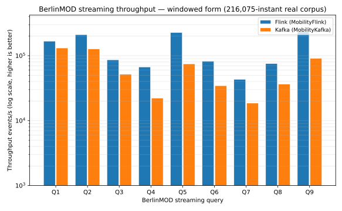

# BerlinMOD three-platform stream benchmark

## What this benchmark measures

The streaming benchmark runs the BerlinMOD query set as continuous stream jobs
rather than batch SQL: each query evaluated event-by-event over a corpus of
vehicle instants, in three forms — continuous, windowed, snapshot.

This benchmark measures per-query throughput across three stream engines —
MobilityFlink, MobilityKafka, and MobilityNebula — that share the same MEOS
kernel and evaluate the same predicates over the same corpus. The aim is a
diagnostic, not a leaderboard: where each engine pays its cost, with the batch
result as the correctness oracle.

## Workload

The query set is the BerlinMOD R-queries recast in the forms suited to a stream
(see [`README.md`](README.md) for the full set and each query's R-query lineage).
Every query runs in three forms:

- **continuous** — emits `predicate(event)` for every event as it arrives.
- **windowed** — aggregates the predicate over tumbling windows.
- **snapshot** — samples each vehicle's last-known position at tick instants; by
  contract the snapshot at watermark `T` equals the batch result at `T`, which is
  the bridge to the DB benchmark.

The cell shared with the DB benchmark is the within-distance predicate
(`edwithin_tgeo_geo`), evaluated through the same MEOS call on every platform.

## Dataset, hardware, methodology

The corpus is BerlinMOD `berlinmod_instants.csv` — 216 075 instants, 5 vehicles,
~11 days — reprojected EPSG:3857→EPSG:4326 through MEOS `geo_transform` at load.
The point `P`, region box, road segment, points of interest, and target vehicle
ids derive from the corpus (`P` = centroid), and the window/tick granularity
scales to the corpus span.

The throughput grid below was measured on the machine described next; numbers are
absolute to that host, so re-run the harnesses on yours and regenerate the Machine
block with [`scripts/machine.sh`](scripts/machine.sh) to reflect your config.

### Machine

- **CPU** — AMD Ryzen 9 5900HX with Radeon Graphics (8 cores / 16 threads)
- **Memory** — 23Gi
- **OS** — Ubuntu 24.04.4 LTS, kernel `6.6.87.2-microsoft-standard-WSL2`, WSL2 (memory-capped VM, shared host)
- **Runtime** — openjdk 21.0.11 2026-04-21
- **libmeos** — built `-DMEOS=ON -DCBUFFER=ON -DNPOINT=ON -DPOSE=ON -DRGEO=ON`

### Per-engine harnesses

- **Flink** — Flink 1.16 single-node local mini-cluster, parallelism 1. Harness
  [`MobilityFlink` `BerlinMODBenchmark`](https://github.com/MobilityDB/MobilityFlink/blob/main/flink-processor/src/main/java/berlinmod/BerlinMODBenchmark.java).
- **Kafka** — Kafka Streams 3.6, one stream thread, each cell a `KafkaStreams`
  application against its own fresh in-process `EmbeddedKafkaCluster` (a real
  `KafkaServer` over loopback). Harness
  [`MobilityKafka` `EmbeddedBrokerBenchmark`](https://github.com/MobilityDB/MobilityKafka/blob/main/kafka-streams-app/src/test/java/berlinmod/EmbeddedBrokerBenchmark.java).
- **Nebula** — NebulaStream harness.

## Invariants held fixed

These hold for every (query, form, engine) cell.

- **Same MEOS predicate.** Every platform evaluates the identical MEOS spatial
  call; the per-cell query shape is the same across engines.
- **Throughput definition.** Each cell runs as one streaming job over the shared
  corpus, terminated by a counting sink; throughput is input events ÷ wall-clock
  and `output rows` is the sink cardinality.
- **Corpus-derived parameters.** All query parameters and the window/tick
  granularity derive from the same corpus, identical on every platform.
- **Batch oracle.** The continuous form is checked event-for-event against a
  batch pass over the same corpus through the same MEOS call (see Parity).

## Results — throughput (events/s)

MobilityFlink and MobilityKafka are measured on the machine above, over the same
corpus through the same MEOS predicate. The MobilityNebula column is open (see
[Contributing your numbers](#contributing-your-numbers)). The charts below plot the
measured columns.

| Query | Form | MobilityFlink | MobilityKafka | MobilityNebula |
|---|---|---:|---:|---:|
| Q1 | continuous | 87,057 | 78,091 | — |
| Q1 | windowed | 187,565 | 201,941 | — |
| Q1 | snapshot | 205,199 | 200,442 | — |
| Q2 | continuous | 213,302 | 260,334 | — |
| Q2 | windowed | 215,000 | 222,530 | — |
| Q2 | snapshot | 228,168 | 226,022 | — |
| Q3 | continuous | 68,443 | 86,673 | — |
| Q3 | windowed | 88,519 | 79,940 | — |
| Q3 | snapshot | 217,598 | 167,372 | — |
| Q4 | continuous | 59,971 | 44,387 | — |
| Q4 | windowed | 65,438 | 41,859 | — |
| Q4 | snapshot | 69,100 | 40,502 | — |
| Q5 | continuous | 24,105 | 12,544 | — |
| Q5 | windowed | 229,623 | 137,018 | — |
| Q5 | snapshot | 230,357 | 173,417 | — |
| Q6 | continuous | 95,103 | 52,117 | — |
| Q6 | windowed | 97,595 | 51,718 | — |
| Q6 | snapshot | 96,764 | 55,234 | — |
| Q7 | continuous | 58,085 | 86,018 | — |
| Q7 | windowed | 44,278 | 30,684 | — |
| Q7 | snapshot | 57,589 | 47,178 | — |
| Q8 | continuous | 69,299 | 78,346 | — |
| Q8 | windowed | 80,355 | 65,123 | — |
| Q8 | snapshot | 239,286 | 144,824 | — |
| Q9 | continuous | 137,452 | 76,325 | — |
| Q9 | windowed | 231,096 | 141,504 | — |
| Q9 | snapshot | 235,376 | 134,880 | — |

### Throughput charts (events/s, log scale, higher is better)

One grouped bar chart per streaming form, all three engines on the same corpus.

## Reading the results

Q5-continuous is the floor on both engines (MobilityKafka 12,544, MobilityFlink
24,105 ev/s): it enumerates every meeting pair across all vehicles on each event
(O(V²) per event). The non-spatial Q1/Q2 continuous cells sit near the ceiling
(Q2-continuous 260,334 on Kafka, 213,302 on Flink), and the per-event spatial
cells (Q3/Q8/Q9-continuous) cluster between, in the 68k–137k ev/s band. The
windowed and snapshot forms aggregate or sample rather than emit per event, so
they run several times faster than their continuous counterpart. The two engines
land within a small factor of each other on every cell, on the same corpus
through the same MEOS predicate; the snapshot form is sampled, so a within-`P`
snapshot can be empty when no vehicle is within `d` of `P` at a tick boundary even
though the continuous form reports near-`P` events between boundaries.

The continuous form's output cardinality is identical across MobilityFlink and
MobilityKafka for all nine queries (Q1 5, Q2 61 170, Q3 216 075, Q4 62, Q5 73 063,
Q6 216 075, Q7 5, Q8 216 075, Q9 107 870), so the per-event predicate truth is the
same on both engines. The windowed and snapshot forms differ in emission
cardinality between the harnesses (each samples/aggregates by its own convention),
so their throughput is read per engine, not compared row-for-row.

## Parity with the DB benchmark

The continuous form emits `predicate(event)` for every event, checked
event-for-event against a batch pass over the same corpus through the same MEOS
call — the cross-family link to the
[3-DB benchmark](../CrossPlatform_timings.md), whose batch result is
the oracle. A query is `exact` when streaming-true equals batch-true with zero
mismatches.

| Query | Events | Streaming-true | Batch-true | Mismatches | Parity |
|---|---:|---:|---:|---:|---|
| Q3 (`edwithin_tgeo_geo`, within `d` of `P`) | — | — | — | — | — |
| Q8 (`edwithin_tgeo_geo`, within `d` of segment) | — | — | — | — | — |

## Contributing your numbers

Each engine owns one column of the throughput grid and its parity rows.

1. Run your harness over the corpus (links under [Methodology](#dataset-hardware-methodology)),
   producing one throughput value per (query, form).
2. Fill your engine's column in the **Results** grid and, for the continuous
   spatial queries, your **Parity** counts.
3. Add your series to
   [`scripts/render_streaming_chart.py`](scripts/render_streaming_chart.py) and run
   `python3 scripts/render_streaming_chart.py` to refresh the charts, and regenerate
   the Machine block on your host with `bash scripts/machine.sh`.

## Reproduce

Regenerate the charts from
[`scripts/render_streaming_chart.py`](scripts/render_streaming_chart.py) — run
`python3 scripts/render_streaming_chart.py` to refresh all three SVGs. The
per-engine run harnesses are linked under Methodology.
